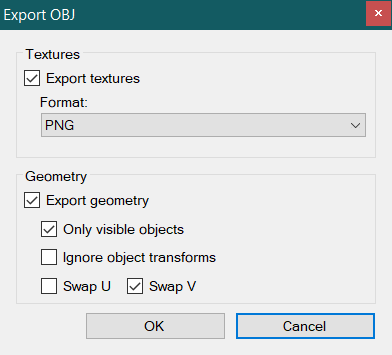

# Demolisher v0.3.4

## Summary

_Demolisher_ an extremely basic viewer for the BIN model format found in [Luigi's Mansion](http://en.wikipedia.org/wiki/Luigi%27s_Mansion).
The program is capable of opening and viewing one or multiple BIN model files at one time and comes with a bunch of different view modes and options.
Demolisher also supports exporting to OBJ with MTL. It cannot create BIN models. The OBJ output is not compatible with the game.

This program makes use of [OpenTK](http://www.opentk.com) for rendering and input.

## Use

### Controls
To move the main view camera, use the ESDF keys for forward, leftward, backward, and rightward movement respectively.
Holding shift while pressing any of the movement keys while double the camera's speed.
To rotate the camera's pitch and yaw, use the arrow keys.
There is an option to invert the pitch controls.

### Export OBJ
> 
> 
> *OBJ Export Dialog in v0.3.4*

- **Export textures:** If enabled, all textures of the objects will be exported.
  - **Format:** The format for which each texture will export to. Selectable formats are: PNG, TIFF, BMP, and JPEG.
- **Export geometry:** If enabled, all geometry of the objects will be exported.
  - **Only visible objects:** Export the geometry of only the visible objects (only checkbox'd objects)
  - **Ignore object transforms:** Do not export objects via the position they appear visually (every object will export at origin 0,0,0).
  - **Swap U:** Swap UV horizontal coordinates.
  - **Swap V:** Swap UV vertical coordinates.

**NOTE:** Wrap mode for materials are not considered. This must be manually done from whatever 3D software you plan to import the OBJ to. (ergo, materials that have a wrap mode of CLAMP, MIRROR, or REPEAT will not appear correctly). To see what wrap mode each material has, the wrap mode will be written for each material in the MTL as `# WrapS - ...` and `# WrapT - ...` (open the MTL in a text editor of your choice).

### Render Flags
There are certain flags and data in the BIN model format for graph objects which are displayed in _Demolisher_ (some of which can be toggled).
The supported ones are as follows:

- Ceilings
- Fourth walls (or any object that is shown only in the GBH view)
- Full-bright (such as lamps)
- Bounding boxes

As well as the visibility flags above, you can set the individual visibility of each loaded BIN model and their graph objects.

### Support
_Demolisher_ also supports the following:

- NBT (normal/binormal/tangent) vector display on vertices
- Wireframe view
- Unit grid (X/Z axis)
- Texture alpha (cut-off and blend)
- Emboss-mapped surfaces (`emboss.fp` and `emboss.vp`)

_Demolisher_ supports _only_ BIN models — BDL and BMD are not supported; however, you may open and view any number of BIN model files at a single time.

## Building

### Prerequisites
- Visual Studio 2019
- .NET Framework 4 Client Profile
